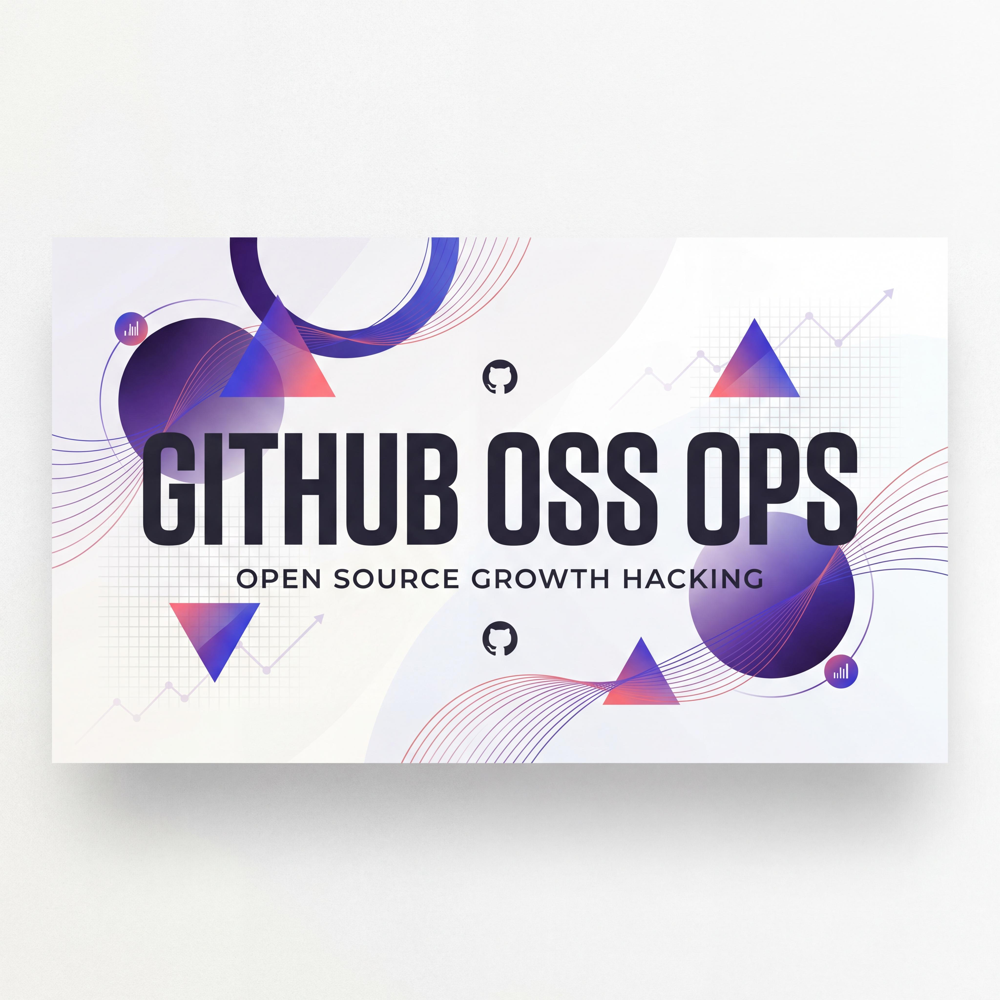

<div align="center">



# 🚀 github-oss-ops

**Your AI-Powered Open Source Growth Engine**

**你的 AI 开源项目增长引擎**

[](#platform-setup)
[](#license)
[-orange)](#how-it-works)

Stop guessing. Start growing. A battle-tested playbook distilled into an AI skill that turns your GitHub project from invisible to unstoppable.

别再凭感觉运营了。一套经过实战验证的增长方法论，浓缩为 AI 技能，让你的 GitHub 项目从无人问津到势不可挡。

[English](#english) · [中文](#中文)

</div>

---

<a id="english"></a>

## Why This Skill Exists

Every day, thousands of open source projects are born on GitHub. Most die in obscurity — not because the code is bad, but because **nobody ever finds out about them**.

The gap between "great project" and "popular project" isn't code quality. It's **operations**: how you position, promote, and nurture your project into a self-sustaining community.

This skill bridges that gap. It encodes the collective wisdom from real-world open source growth playbooks into an AI assistant that sits inside your daily workflow — diagnosing your project's stage, generating tailored growth plans, writing your README, drafting your Hacker News launch post, and iterating with you as your metrics evolve.

### What Makes This Different

| Feature | Generic AI Advice | **github-oss-ops** |
|---------|-------------------|--------------------|
| Stage awareness | One-size-fits-all tips | Diagnoses your project phase (0→100 / 100→1K / 1K+) and adapts strategy |
| Actionable output | "Write better docs" | "Add an asciinema GIF to your README, publish to r/Python Tuesday 8am EST, expect +30 stars" |
| Anti-patterns | Might suggest star-gaming | 7 built-in guardrails against common traps (star-buying, spam posting, etc.) |
| Iteration loop | One-shot advice | Built-in PDCA cycle with checkpoints, failure diagnosis, and Plan B |
| Templates | "You should have a CONTRIBUTING.md" | Ships 6 production-ready templates (CONTRIBUTING, CoC, Issue/PR templates, SECURITY) |
| Multi-platform | Platform-locked | Runs on Mira, Claude Code, OpenClaw, or any SKILL.md-compatible agent |

### Core Capabilities

- **Project Diagnosis** — Automatically identifies your growth stage and bottlenecks
- **Growth Plan Generation** — 30-day quick wins + 90-day roadmap + metrics tracking table
- **README Rewriting** — Complete README.md with badges, benchmarks, quick start, and architecture diagrams
- **Content Operations** — Tech blogs, social media copy (Twitter/Reddit/HN), CFP proposals
- **Community Governance** — CONTRIBUTING.md, CODE_OF_CONDUCT, Issue/PR templates, SECURITY.md
- **Strategy Iteration** — Built-in PDCA framework for continuous improvement

### The 4-Step Workflow

```
┌─────────────────────────────────────────────────────────────────────────────┐
│  DIAGNOSE  →  PLAN  →  EXECUTE  →  ITERATE                                   │
├─────────────────────────────────────────────────────────────────────────────┤
│  • Current metrics    • 30-day quick wins   • Write content     • Check KPIs  │
│  • Project stage      • 90-day roadmap      • Optimize README   • Analyze    │
│  • Key bottlenecks    • Channel strategy    • Launch campaign   • Adjust     │
└─────────────────────────────────────────────────────────────────────────────┘
```

### Platform Setup

#### Mira (ByteDance)

This skill is pre-installed for Mira users. Simply invoke it with:

```
/mira-user-skills:github-oss-ops My project has 50 stars, how do I grow to 500?
```

#### Claude Code (Anthropic)

1. **Copy the skill folder** to your Claude Code custom skills directory:
   ```bash
   cp -r github-oss-ops/ ~/.claude/skills/github-oss-ops/
   ```

2. **Restart Claude Code** or run `/refresh`

3. **Invoke naturally** — the skill triggers on open-source related queries:
   ```
   > I have a Python CLI tool with 12 stars, how do I get to 100?
   ```

#### OpenClaw / Any SKILL.md-Compatible Agent

1. **Clone or download** this repository
2. **Place the folder** in your agent's skills directory
3. **Reference the SKILL.md** path in your agent's configuration

### File Structure

```
github-oss-ops/
├── SKILL.md                          # Main skill file (207 lines)
├── README.md                         # This file
├── LICENSE                           # MIT License
└── references/
    ├── growth-playbook.md            # Complete 0→1000 Stars strategy (436 lines)
    └── templates.md                  # 6 community governance templates (316 lines)
```

### Example Interactions

**Early-stage growth (0-100 stars):**
```
User: I just released a Python CLI tool. It solves [X problem] but only has 3 stars.

Skill: [Diagnoses as early stage] → [Generates 30-day quick wins] → [Optimizes README]
→ "Your README spends 70% on API docs but 0% on 'why this exists'. Here's a rewrite..."
```

**Growth plateau (100-500 stars):**
```
User: My project grew to 150 stars in month 1 but now it's stuck.

Skill: [Identifies contributor funnel blockage] → [Suggests good-first-issues]
→ "You have users but no contributors. Create these 3 issues labeled 'good first issue'..."
```

**Mature project optimization (1000+ stars):**
```
User: We have 2K stars but only 5 contributors. How do we build a maintainer community?

Skill: [Analyzes governance gaps] → [Proposes contribution tiers]
→ "Add a CONTRIBUTING.md with clear triage process and CODE_OF_CONDUCT..."
```

---

<a id="中文"></a>

## 为什么创建这个技能

每天都有数千个开源项目在 GitHub 上诞生。大多数在默默无闻中消亡——不是因为代码质量差，而是因为**根本没人知道它们的存在**。

"好项目"和"受欢迎的项目"之间的差距不在于代码，而在于**运营**：如何定位、推广和培育你的项目，让它成为一个自我维持的社区。

这个技能弥合了这种差距。它将真实世界的开源增长方法论编码进 AI 助手，融入你的日常工作流——诊断项目阶段、生成定制化增长计划、撰写 README、起草 Hacker News 发布文案，并随着指标变化与你一起迭代。

### 与众不同之处

| 特性 | 通用 AI 建议 | **github-oss-ops** |
|------|-------------|-------------------|
| 阶段感知 | 千篇一律的建议 | 诊断项目阶段（0→100 / 100→1K / 1K+）并自适应策略 |
| 可执行输出 | "写更好的文档" | "在 README 添加 asciinema GIF，周二早 8 点发布到 r/Python，预期 +30 stars" |
| 反模式防护 | 可能建议刷星 | 内置 7 条常见陷阱防护（刷星、垃圾推广等） |
| 迭代闭环 | 一次性建议 | 内置 PDCA 循环，含检查点、失败诊断和 Plan B |
| 模板库 | "你应该有 CONTRIBUTING.md" | 提供 6 个生产级模板（贡献指南、行为准则、Issue/PR 模板、安全策略） |
| 跨平台 | 平台锁定 | 支持 Mira、Claude Code、OpenClaw 及任何兼容 SKILL.md 的 Agent |

### 核心能力

- **项目诊断** — 自动识别增长阶段和瓶颈
- **增长计划生成** — 30 天速赢 + 90 天路线图 + 指标追踪表
- **README 重写** — 完整的 README.md，含 Badge、性能数据、快速开始、架构图
- **内容运营** — 技术博客、社交媒体文案（Twitter/Reddit/HN）、CFP 提案
- **社区治理** — CONTRIBUTING.md、CODE_OF_CONDUCT、Issue/PR 模板、SECURITY.md
- **策略迭代** — 内置 PDCA 框架持续优化

### 四步工作流

```
┌─────────────────────────────────────────────────────────────────────────────┐
│  诊断  →  规划  →  执行  →  迭代                                               │
├─────────────────────────────────────────────────────────────────────────────┤
│  • 当前指标      • 30 天速赢     • 撰写内容      • 检查 KPI                    │
│  • 项目阶段      • 90 天路线图   • 优化 README   • 归因分析                    │
│  • 核心瓶颈      • 渠道策略      • 启动推广      • 策略调整                    │
└─────────────────────────────────────────────────────────────────────────────┘
```

### 平台配置指南

#### Mira（字节跳动）

Mira 用户已预装此技能。直接调用：

```
/mira-user-skills:github-oss-ops 我的项目有 50 个 star，怎么增长到 500？
```

#### Claude Code（Anthropic）

1. **复制技能文件夹**到 Claude Code 自定义技能目录：
   ```bash
   cp -r github-oss-ops/ ~/.claude/skills/github-oss-ops/
   ```

2. **重启 Claude Code** 或运行 `/refresh`

3. **自然调用** — 技能会在开源相关查询时自动触发：
   ```
   > 我有一个 Python CLI 工具，只有 12 个 star，怎么涨到 100？
   ```

#### OpenClaw / 任何兼容 SKILL.md 的 Agent

1. **克隆或下载**此仓库
2. **放置文件夹**到你的 Agent 技能目录
3. **引用 SKILL.md** 路径到你的 Agent 配置

### 文件结构

```
github-oss-ops/
├── SKILL.md                          # 主技能文件（207 行）
├── README.md                         # 本文件
├── LICENSE                           # MIT 许可证
└── references/
    ├── growth-playbook.md            # 完整的 0→1000 Stars 策略（436 行）
    └── templates.md                  # 6 个社区治理模板（316 行）
```

### 示例交互

**早期增长（0-100 stars）：**
```
用户：我刚发布了一个 Python CLI 工具，解决 [X 问题]，但只有 3 个 star。

技能：[诊断为早期阶段] → [生成 30 天速赢方案] → [优化 README]
→ "你的 README 花了 70% 篇幅讲 API 文档，0% 讲'为什么存在'。这是重写版本..."
```

**增长瓶颈（100-500 stars）：**
```
用户：我的项目第一个月涨到 150 stars，现在卡住了。

技能：[识别贡献者漏斗阻塞] → [建议 good-first-issues]
→ "你有用户但没有贡献者。创建这 3 个标有 'good first issue' 的 Issue..."
```

**成熟项目优化（1000+ stars）：**
```
用户：我们有 2K stars，但只有 5 个贡献者。怎么建立维护者社区？

技能：[分析治理缺口] → [提出贡献层级]
→ "添加带清晰分流流程的 CONTRIBUTING.md 和 CODE_OF_CONDUCT..."
```

---

## License

MIT License — see [LICENSE](LICENSE) file for details.

---

<div align="center">

**Built with ❤️ for the open source community**

If this skill helps your project grow, consider giving it a ⭐ and sharing your story!

如果这个技能帮助你的项目成长，欢迎点个 ⭐ 并分享你的故事！

</div>
